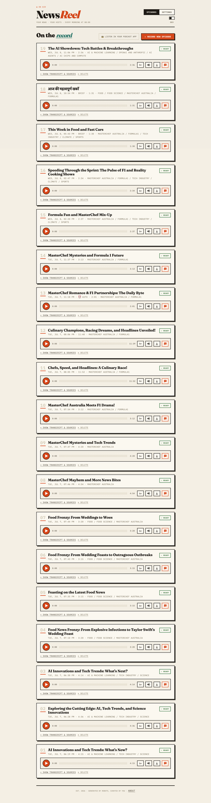
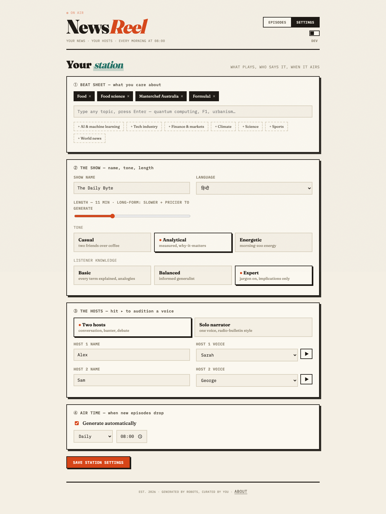
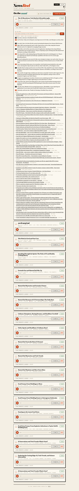
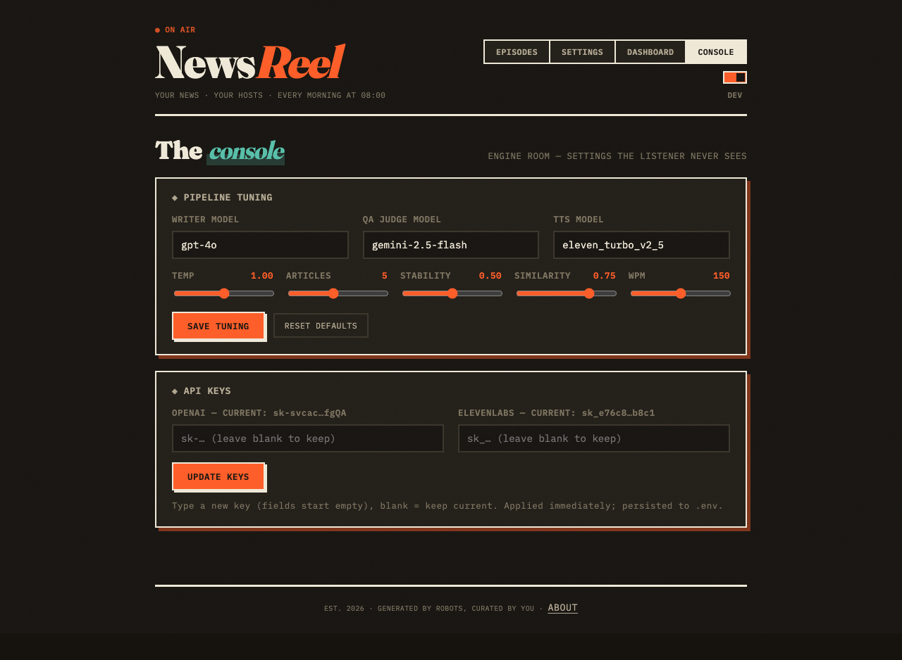

# 🎙️ NewsReel — Personal Podcast Generator

Set your interests → it gathers fresh news on your schedule → generates a podcast episode with AI hosts, QA-reviewed by a second AI provider before it airs.

**▶️ Hear it: [`sample.mp3`](sample.mp3)**

Highlights: two-host or solo formats (deep dive / brief / debate) · one-click show profiles ·
per-episode focus steering + optional article link as an extra source · **Ask the Hosts** —
question any episode by text or voice, get a grounded answer spoken back, and turn unanswered
questions into the next episode with one click · **edit any transcript line and re-voice just
that line (~0.6s)** · 5 languages · subscribe from any podcast app via private RSS · developer
mode with pipeline tuning and an internal metrics dashboard.

See [`solution.md`](solution.md) for architecture and decisions, or [`docs/report.html`](docs/report.html) for a formatted engineering report (system design, full click-to-audio workflow, reliability gates, bugs found and fixed).

## Screenshots

|  |  |
|---|---|
| **Landing** — animated intro & about | **Episodes** — record, play, ask, delete |
|  |  |
| **Settings** — interests, hosts, schedule | **Ask the Hosts** — grounded Q&A by text or voice |
|  |  |
| **Dashboard** (dev mode) — pipeline health metrics | **Console** (dev mode) — model & voice tuning |
|  |  |

## Quick start

Requires Docker, Python 3.11+, Node 20+.

```bash
cp .env.example .env        # add OpenAI + ElevenLabs (+ optional Gemini) keys
./scripts/dev.sh start      # Postgres + backend (:8001) + frontend (:5173)
```

`./scripts/dev.sh stop` shuts everything down; `status` shows what's running.
First run installs the venv and node_modules automatically. Logs land in `.run/`.

<details>
<summary>Manual startup (what the script does)</summary>

```bash
docker compose up -d

cd backend
python3 -m venv .venv && .venv/bin/pip install -r requirements.txt
.venv/bin/uvicorn app.main:app --port 8001

cd ../frontend
npm install && npm run dev           # open http://localhost:5173
```
</details>

Settings → add interests → save → Episodes → ▸ RECORD NEW EPISODE (~40s for a 4-min episode).
Flip the **DEV** toggle (top right) for the internal dashboard and pipeline console.
